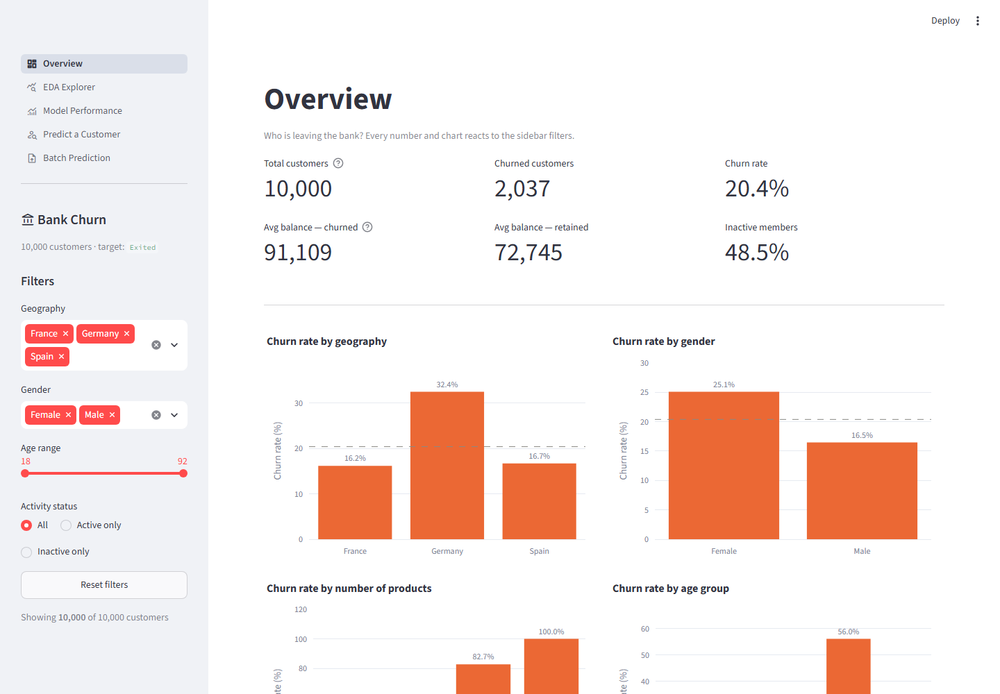
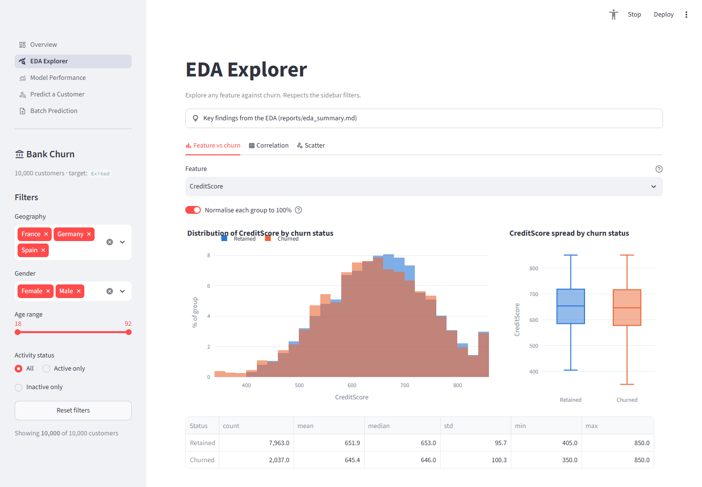
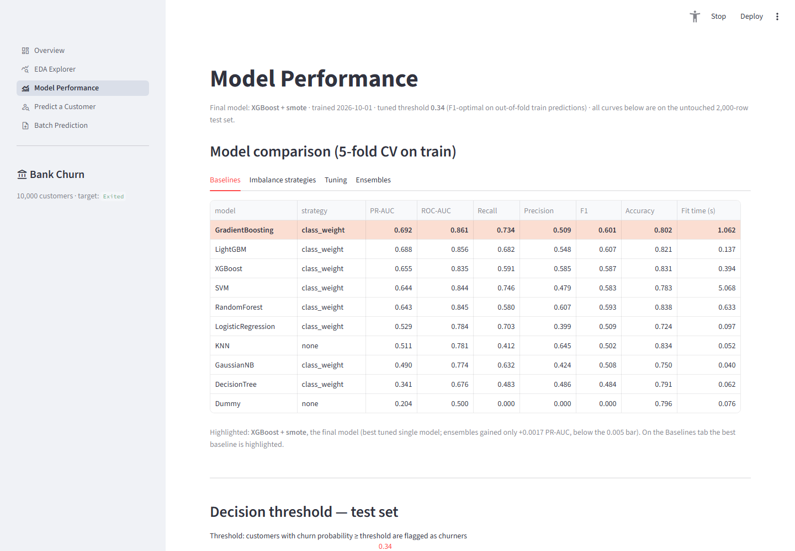
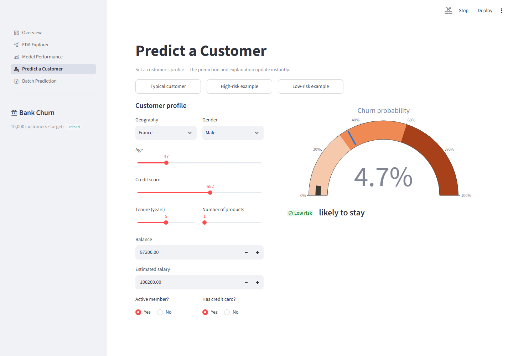
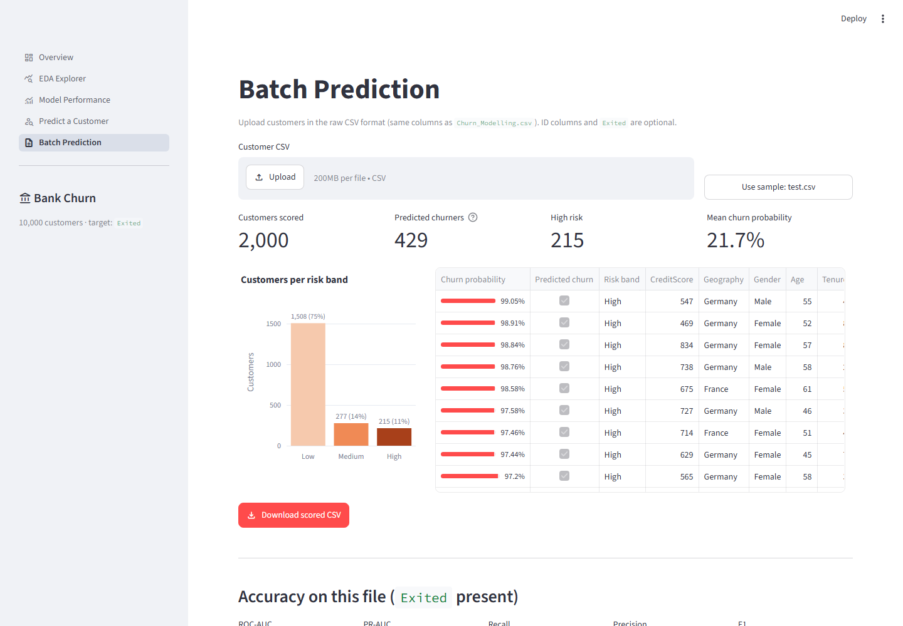

# Bank Customer Churn Prediction

Predict which bank customers are about to leave, explain why, and explore it all in an interactive Streamlit
dashboard.

**Final model:** tuned XGBoost + SMOTE. On the held-out test set it scores **ROC-AUC 0.867 and PR-AUC 0.718**, and at
the tuned threshold it catches **66% of churners** (vs 52% at the default 0.5).



---

## Problem
The bank loses about 1 in 5 customers. Keeping a customer is far cheaper than winning a new one, so the goal is to:

1. **predict** each customer's probability of churning (`Exited = 1`),
2. **explain** what drives the risk, both overall and for each customer,
3. **act** on it, through a dashboard that business users can explore and use to score new customer lists.

The target is imbalanced (20.4% churn), so a model that always says "stays" is already 79.6% accurate. The project
is therefore optimised for **recall on churners and PR-AUC**, not accuracy.

## Dataset
`backend/data/raw/Churn_Modelling.csv`: 10,000 customers × 14 columns, with no missing values or duplicates.

| Column | Type | Notes |
|---|---|---|
| `RowNumber`, `CustomerId`, `Surname` | identifier | dropped; no predictive value |
| `CreditScore` | int | 350–850 |
| `Geography` | category | France 50%, Germany 25%, Spain 25% |
| `Gender` | category | Male 55%, Female 45% |
| `Age` | int | 18–92 |
| `Tenure` | int | years with the bank, 0–10 |
| `Balance` | float | 36% of customers have exactly 0 |
| `NumOfProducts` | int | 1–4 (3 and 4 are rare) |
| `HasCrCard`, `IsActiveMember` | binary | |
| `EstimatedSalary` | float | roughly uniform 0–200k |
| **`Exited`** | **target** | 1 = churned (2,037 customers, 20.4%) |

## Approach
1. **Validate and split:** schema, type and range checks, then a stratified 80/20 split *before* any fitting.
2. **EDA:** univariate, bivariate and multivariate analysis, chi-square and Mann-Whitney tests, and VIF.
3. **Features:** a stateless `FeatureEngineer` adds 7 features (`BalanceZero`, `BalanceSalaryRatio`, `TenureByAge`,
   `CreditScoreGivenAge`, `ProductsPerTenure`, `AgeGroup`, `IsSenior`). The steps
   `FeatureEngineer → ColumnTransformer → [SMOTE] → model` form one `imblearn` Pipeline, so nothing leaks from
   validation or test data.
4. **Modelling:** 10 baselines → 4 imbalance strategies for the top 3 → `RandomizedSearchCV` tuning → voting and
   stacking ensembles, all with 5-fold stratified CV on the train set.
5. **Threshold:** chosen on out-of-fold train predictions (F1-optimal = 0.34). The test set is scored exactly once.
6. **Explainability:** permutation importance plus SHAP (global and per customer).

Full write-up: [`backend/reports/final_report.md`](backend/reports/final_report.md).

## Results

**Model comparison** (5-fold CV on train, PR-AUC; full tables are in `backend/reports/`):

| Model | Baseline | + best imbalance strategy | Tuned |
|---|---|---|---|
| **XGBoost** | 0.655 | 0.668 (SMOTE) | **0.698** ← final |
| Gradient Boosting | 0.692 | 0.692 (class weight) | 0.695 |
| LightGBM | 0.688 | 0.688 (class weight) | 0.695 |
| Soft voting / Stacking of the 3 tuned models | | | 0.699 / 0.699 (gain < 0.005, not kept) |
| SVM · Random Forest · Logistic Regression · KNN · NB · Decision Tree | 0.644 · 0.643 · 0.529 · 0.511 · 0.491 · 0.341 | | |
| Dummy (always "stays") | 0.204, recall 0, accuracy 0.796 | | |

**Final model on the held-out test set** (2,000 customers; from
[`final_metrics.json`](backend/reports/final_metrics.json)):

| Threshold | ROC-AUC | PR-AUC | Precision | Recall | F1 | Accuracy |
|---|---|---|---|---|---|---|
| 0.50 (default) | 0.867 | 0.718 | 0.763 | 0.523 | 0.621 | 0.870 |
| **0.34 (F1-optimal, used)** | 0.867 | 0.718 | 0.629 | **0.663** | **0.646** | 0.852 |
| 0.22 (recall ≥ 0.75) | | | 0.491 | 0.769 | 0.599 | 0.790 |
| 0.17 (cost-optimal, FN = 5 × FP) | | | 0.442 | 0.828 | 0.576 | 0.752 |

Test ROC-AUC matches CV (0.864), and the probabilities are well calibrated (Brier score 0.099).

## Top churn drivers
From SHAP and permutation importance; details and recommendations are in
[`model_insights.md`](backend/reports/model_insights.md).

1. **Number of products:** 2 products is the safe spot (7.6% churn); 1 product 27.7%; **3–4 products 86%**.
2. **Age:** risk rises steeply from about 42 and **peaks at 50–59 (56% churn)**, then drops after 65.
3. **Inactive members** churn about 2× as often (26.9% vs 14.3%).
4. **Germany** churns at 32.4% vs about 16% in France and Spain; German women reach 37.6%.
5. **High balance with a single product** (26.9%), and **women** (25.1% vs 16.5%).
6. Credit score, tenure, salary and having a credit card have **almost no effect**.

The best retention target is **inactive German customers aged 40–59, who churn at 60.9%**.

## Dashboard
`streamlit run frontend/app.py` has five pages, with sidebar filters (geography, gender, age, activity) shared
across them:

| Page | What it does |
|---|---|
| **Overview** | KPI cards and churn-rate charts that react to the filters |
| **EDA Explorer** | any feature vs churn, interactive correlation heatmap, free scatter plot, key findings |
| **Model Performance** | model comparison tables, a threshold slider that live-updates the confusion matrix, metrics and PR/ROC operating point, and feature importance / SHAP |
| **Predict a Customer** | form for all 10 features: churn gauge, risk band, top 3 reasons and a SHAP waterfall |
| **Batch Prediction** | upload a CSV and get a scored, sortable table, a risk-band chart and a CSV download (with metrics if `Exited` is present) |

| EDA Explorer | Model Performance |
|---|---|
|  |  |
| **Predict a Customer** | **Batch Prediction** |
|  |  |

## How to run
Requires **Python 3.11–3.13**. All commands are run from the project root; on Windows use `mingw32-make` instead
of `make`, or run the commands in the right-hand column directly.

| Step | Make target | Plain command |
|---|---|---|
| Install | `make install` | `python -m venv .venv` then `pip install -r requirements.txt` |
| Train end-to-end (raw CSV → model, about 5 min) | `make train` | `cd backend && python -m src.train` |
| Quick retrain from the saved tuned settings (< 1 min) | | `cd backend && python -m src.train --stage final` |
| EDA figures and tables | `make eda` | `cd backend && python -m src.eda` |
| Dashboard | `make dashboard` | `streamlit run frontend/app.py` |
| Tests (backend + dashboard) | `make test` | `cd backend && pytest` · `cd frontend && pytest` |
| Lint / format | | `ruff check backend frontend` · `black backend frontend` |

**Notebooks:** `backend/notebooks/01_eda.ipynb` imports everything from `src/`. Open it with Jupyter from
`backend/notebooks/`.

**Scoring from Python:**
```python
from src.predict import predict          # run from backend/
predict(raw_df)                          # -> churn_probability, churn_prediction, risk_band
```

## Project structure
```
churn-prediction/
├── backend/
│   ├── data/raw/Churn_Modelling.csv      # original data (never modified)
│   ├── data/processed/                   # train.csv / test.csv
│   ├── notebooks/01_eda.ipynb
│   ├── src/
│   │   ├── config.py      # paths, seed, column groups, risk bands
│   │   ├── data.py        # load, validate, prepare, split
│   │   ├── eda.py         # EDA tables, statistical tests, figures
│   │   ├── features.py    # FeatureEngineer, preprocessor, pipeline builder
│   │   ├── train.py       # baselines, imbalance, tuning, ensembles; end-to-end entry point
│   │   ├── evaluate.py    # thresholds, test evaluation, saves the model files
│   │   ├── explain.py     # importances, SHAP, per-customer explanations
│   │   └── predict.py     # predict() for raw rows
│   ├── models/            # best_params / final_model / threshold / metadata JSON (+ pipeline .joblib)
│   ├── reports/           # *.md write-ups, metrics CSV/JSON, figures/
│   └── tests/             # pytest: data, features, train, predict, explain
├── frontend/
│   ├── app.py             # Streamlit entry point (st.navigation)
│   ├── views/             # the five pages
│   ├── ui/                # cached loaders, filters, Plotly charts, batch helpers
│   └── tests/             # Streamlit AppTest page tests
├── docs/screenshots/
├── requirements.txt · pyproject.toml (ruff, black, pytest) · Makefile
```

## Future work
- Add behavioural, time-stamped data (transactions, complaints, logins) for a time-to-churn or survival model.
- Replace the illustrative 5:1 cost assumption with real offer costs and customer lifetime value, and move to uplift
  modelling (target the customers a retention action would actually change).
- Fairness checks by gender and country before customer-facing use.
- Serve `predict()` as an API, track experiments (MLflow), and monitor drift and calibration in production.
